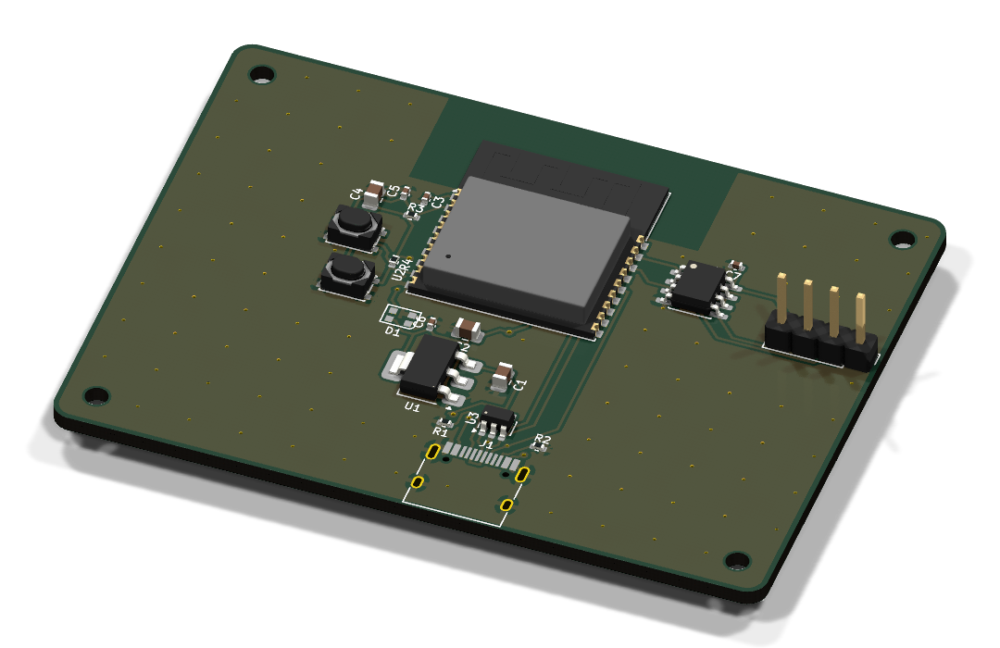
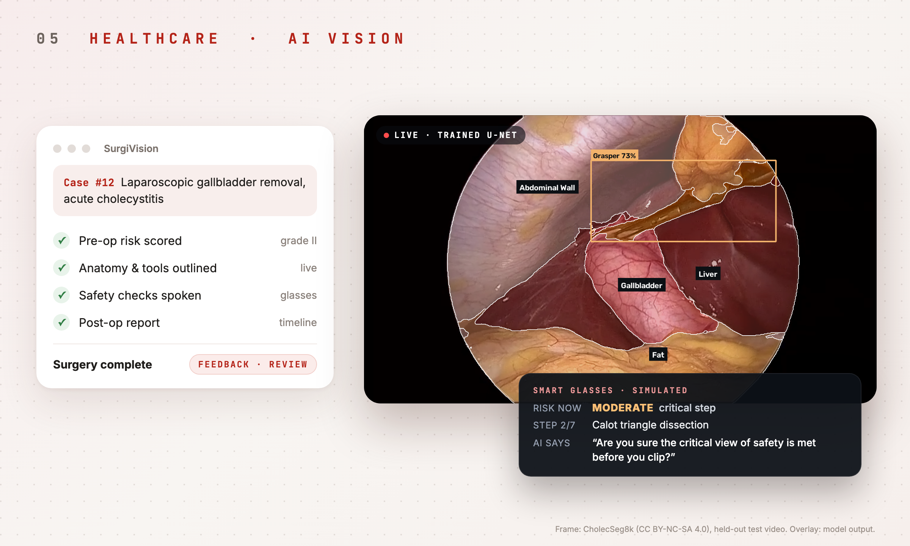

<table>
<tr>
<td width="50%" valign="top">

### [Code2Coder](https://code2coder.org)

**Free Python lessons that run in the browser.**
A real editor, lessons that run the moment you press play, and an AI tutor that gives hints tuned to your code instead of handing over the answer. Python runs on-device through WebAssembly, so there's nothing to install and no account needed. Free for every student and school.

<code>Pyodide</code> · <code>Gemini</code> · <code>live at code2coder.org</code> · <a href="https://github.com/virajrungta/CodeToCoder">source</a>

</td>
<td width="50%" valign="top">

### [GoGlyder](https://github.com/virajrungta/go_glyder)

**Carpooling built around a school community.**
Schools onboard with a join code and publish their calendar. Families then post or find rides along their route, see the detour before they commit, and message the driver in the app. Fewer cars at pickup and fewer hours lost to driving.

<code>Flutter</code> · <code>Firebase</code> · <code>Google Maps</code> · <code>iOS + Android</code>

</td>
</tr>
<tr>
<td width="50%" valign="top">

</td>
<td width="50%" valign="middle">

### [GreenGenius](https://github.com/virajrungta/GreenGenius)

**A plant pot that reports back, and waters itself.**
A smart pot that keeps an eye on your plant for you. It tracks how the plant is doing, tells you on your phone when something's off, and can water it on its own, so houseplants stop dying from guesswork.

<code>hardware</code> · <code>mobile app</code> · <code>IoT</code>

</td>
</tr>
<tr>
<td width="50%" valign="middle">

### [PCB Design Plugin for Claude Code](https://github.com/virajrungta/pcb-claude-plugin)

**From idea to board.**
A plugin for Claude Code: describe the board you want in plain English. It asks a few questions, picks real parts, designs the schematic and layout, checks the result for mistakes and electrical noise, and hands you the files a factory needs to build it. It gets better with every board it designs. Free and open source.

<code>Claude Code plugin</code> · <code>KiCad</code> · <code>electronics</code> · <a href="https://github.com/virajrungta/pcb-claude-plugin">source</a>

</td>
<td width="50%" valign="top">

</td>
</tr>
<tr>
<td width="50%" valign="top">

</td>
<td width="50%" valign="middle">

### SurgiVision

**An AI assistant for gallbladder surgery.**
Before the operation it scores the case's risk from the patient's details. During it, a model I trained on real surgery video outlines the liver, gallbladder and instruments live, and simulated smart glasses speak short safety checks like "Are you sure the critical view is met before you clip?". Afterwards it writes up what happened, step by step. A research prototype, not for clinical use.

<code>PyTorch</code> · <code>FastAPI</code> · <code>React</code> · <code>ElevenLabs</code> · <code>GLM 5.3</code> · built with Anshuman Kumar

</td>
</tr>
</table>

  <a href="https://www.linkedin.com/in/viraj-r711/">LinkedIn</a> &nbsp;·&nbsp;
  <a href="mailto:virajrungta@gmail.com">virajrungta@gmail.com</a> &nbsp;·&nbsp;
  <a href="https://code2coder.org">code2coder.org</a>

