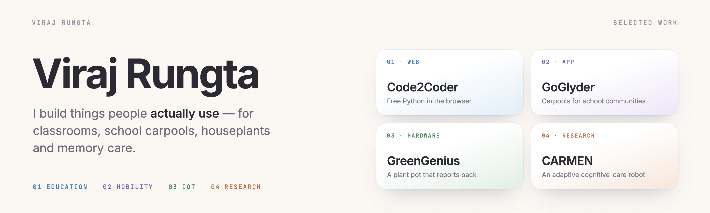
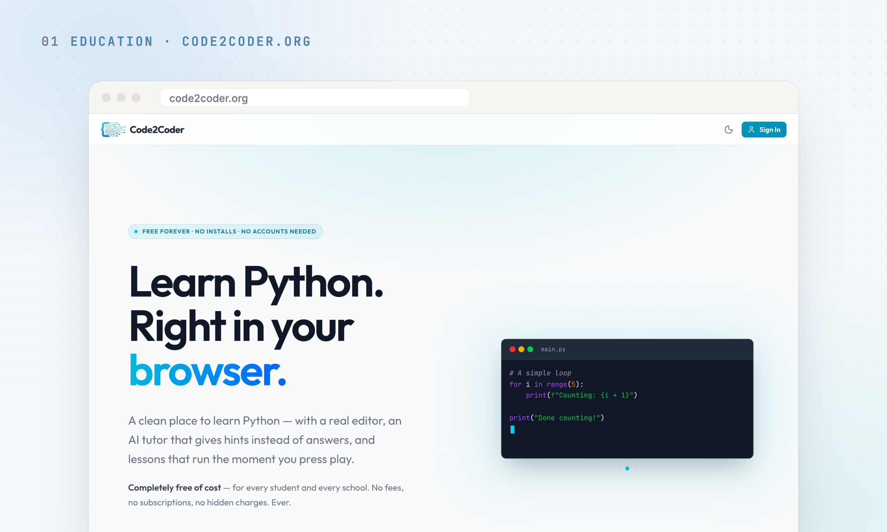
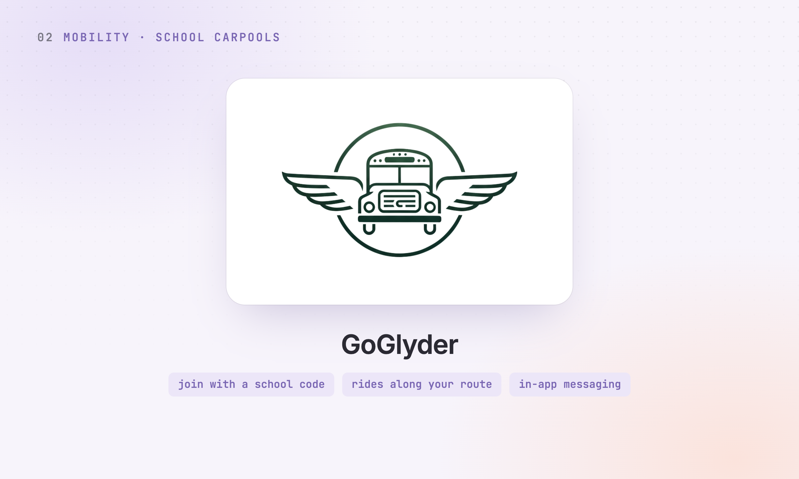
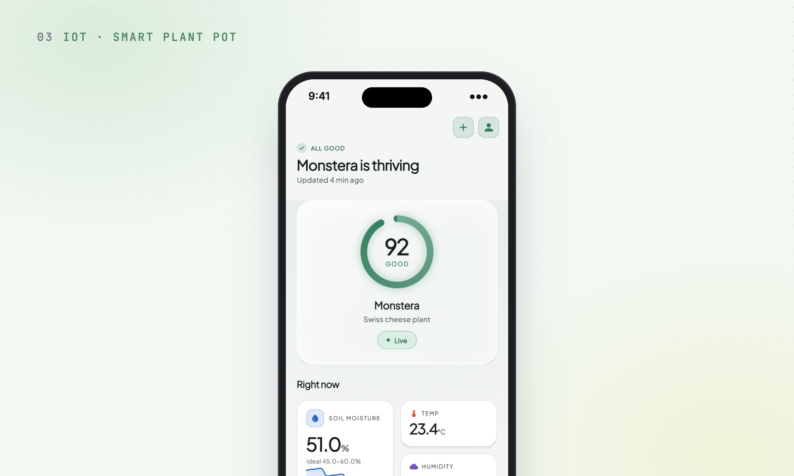
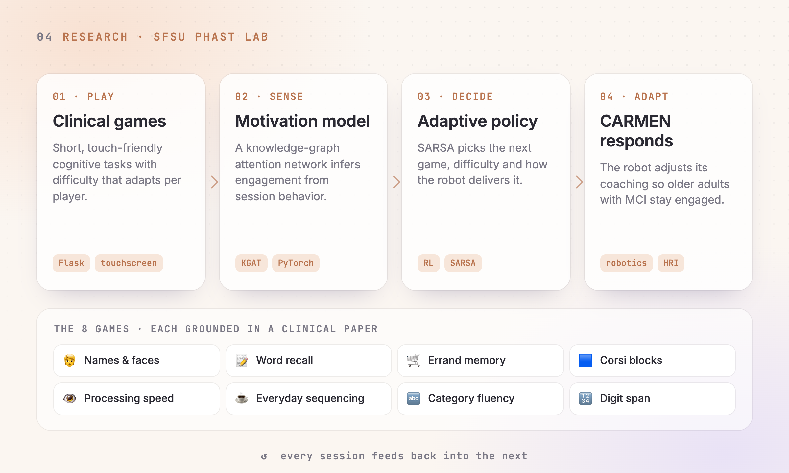

<table>
<tr>
<td width="50%" valign="top">

### [Code2Coder](https://code2coder.org)

**Free Python lessons that run in the browser.**
A real editor, lessons that run the moment you press play, and an AI tutor that gives hints tuned to your code instead of handing over the answer. Python runs on-device through WebAssembly, so there's nothing to install and no account needed. Free for every student and school.

<code>Pyodide</code> · <code>Gemini</code> · <code>live at code2coder.org</code> · <a href="https://github.com/virajrungta/CodeToCoder">source</a>

</td>
<td width="50%" valign="top">

### [GoGlyder](https://github.com/virajrungta/go_glyder)

**Carpooling built around a school community.**
Schools onboard with a join code and publish their calendar. Families then post or find rides along their route, see the detour before they commit, and message the driver in the app. Fewer cars at pickup and fewer hours lost to driving.

<code>Flutter</code> · <code>Firebase</code> · <code>Google Maps</code> · <code>iOS + Android</code>

</td>
</tr>
<tr>
<td width="50%" valign="top">

### [GreenGenius](https://github.com/virajrungta/ggcode)

**A plant pot that reports back, and waters itself.**
An ESP32 board reads soil moisture, temperature, humidity and light, then streams them over MQTT to a FastAPI and TimescaleDB backend. The app pairs over Bluetooth, identifies the plant from a photo, and scores its health against that species' ideal ranges. A pump closes the loop.

<code>ESP32 firmware</code> · <code>BLE + MQTT</code> · <code>FastAPI</code> · <code>Flutter</code> · <code>custom PCB</code>

</td>
<td width="50%" valign="top">

### CARMEN

**A cognitive-care robot that adapts to the person in front of it.**
Built at SFSU's PHAST Lab for older adults with mild cognitive impairment. Eight clinical memory and attention games feed a knowledge-graph attention model of engagement, and a reinforcement-learning policy picks what the robot does next.

<code>PyTorch</code> · <code>reinforcement learning</code> · <code>Flask</code> · <code>research, private repo</code>

</td>
</tr>
</table>

  <a href="https://www.linkedin.com/in/viraj-r711/">LinkedIn</a> &nbsp;·&nbsp;
  <a href="mailto:virajrungta@gmail.com">virajrungta@gmail.com</a> &nbsp;·&nbsp;
  <a href="https://code2coder.org">code2coder.org</a>

